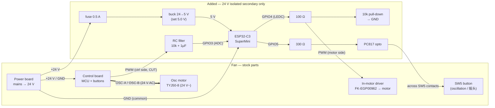

# Heran/Hanny Fan → Home Assistant — Build Guide (ESP32-C3)

Ready-to-build package for the **hybrid** control design derived from the teardown
+ multimeter measurements. See `NOTES.md`, `pcb_2/NOTES.md`, `HA_MOD_NOTES.md` for
the reverse-engineering behind it.

**Design in one line:** ESP32-C3 takes over **speed** by driving the motor
driver's 3.3 V logic **PWM** directly, and controls **oscillation** by "tapping"
the stock **SW5 (摇头)** button through an optocoupler (the stock board keeps
generating the AC the synchronous oscillation motor needs).

Measured facts this relies on:
- `CN2` pin1 `PWM` = **3.3 V logic**, active-high, off = 0 V. 12 speed levels,
  duty ≈ **24 % (L1, min-spin) → ~90 % (L12, max)**. Driver reads the PWM average.
- `CN2` `GND` (pin2), `+24V` (pin3). `OSC-A/B` (pins 4/5) = ~24 V **AC** to the
  `TYJ50-8` synchronous oscillation motor — left to the stock board.

---

## 1. Bill of materials

| # | Part | Notes |
|---|------|-------|
| 1 | **ESP32-C3** dev board | you have one; only 2 GPIOs used |
| 2 | **Buck converter 24 V→5 V** (MP1584 / "mini-360") | set output to **5.0 V** before use |
| 3 | **Optocoupler PC817** (×1) | to tap SW5 |
| 4 | Resistor **330 Ω** | PC817 LED (from GPIO5) |
| 5 | Resistor **100 Ω** | series in the PWM line (optional, tames edges) |
| 6 | **Fuse 0.5 A** + inline holder | on the +24 V tap |
| 7 | Hook-up wire, heatshrink, JST/Dupont | to interpose on `CN2` |
| 8 | *(optional)* **BSS138 level-shifter** module | insurance if PWM turns out 5 V |
| 9 | *(optional)* 5-pin JST male+female | clean inline interposer for `CN2` |

---

## 2. How it hooks in (interpose on the CN2 harness)

We break **only the PWM wire** in the `CN2` harness; everything else passes
through so the stock board still powers the motor and drives oscillation.

### Table A — CN2 harness (control board ↔ motor assembly)
| CN2 pin | Signal | What to do |
|--------:|--------|------------|
| 1 | `PWM` | **CUT.** Motor-side → **ESP GPIO4** (via 100 Ω) **+ ~10 kΩ pull-down to GND**. Control-board side → **RC low-pass → GPIO3** (Option B) or insulate (speed-only). |
| 2 | `GND` | Keep through. Also tie to **ESP GND** and **buck GND** (one common ground). |
| 3 | `+24V` | Keep through. Also tap → **fuse** → **buck +IN**. |
| 4 | `OSC-A` | **Pass through untouched** (stock board drives oscillation). |
| 5 | `OSC-B` | **Pass through untouched.** |

### Table B — ESP32-C3 connections
| ESP32-C3 | To |
|----------|----|
| `5V` | buck **+5 V** out |
| `GND` | buck GND = `CN2 GND` (common) |
| `GPIO4` | 100 Ω → `CN2` `PWM` (**motor side**) |
| `GPIO5` | 330 Ω → PC817 pin 1 (LED anode) |

### Table C — PC817 optocoupler across the SW5 (摇头) button
| PC817 pin | To |
|----------:|----|
| 1 (LED anode) | ESP `GPIO5` via 330 Ω |
| 2 (LED cathode) | ESP `GND` |
| 3 (emitter) | SW5 pad on the **GND side** |
| 4 (collector) | SW5 pad on the **MCU-input side** |

> **Find SW5 polarity first:** with the fan off, meter in DC-V, find which SW5 pad
> sits at a positive voltage (pulled up to the MCU) and which is 0 V (GND). Put the
> PC817 **collector on the pulled-up pad**, **emitter on the GND pad**. If the tap
> doesn't work, swap pins 3/4.

### ASCII overview
```
 POWER BOARD (24V) ──CN1──► CONTROL/DISPLAY BOARD (head) ──┐
                                    │  SW5 (摇头) pads ──[PC817 3/4]
                                    │                        ▲
                           CN2 harness (to motor)            │ opto
   pin1 PWM ─✂─ (ctrl side open)                             │
        motor-side PWM ──100Ω──► GPIO4                       │
   pin2 GND ───────────────┬──► ESP GND ──────[PC817 2]──────┘
   pin3 +24V ──[fuse]──► [24V→5V buck] ──5V──► ESP 5V
   pin4 OSC-A ─────────► (through to TYJ50-8, stock-driven)
   pin5 OSC-B ─────────► (through to TYJ50-8, stock-driven)
                           GPIO5 ──330Ω──► [PC817 1]
```

---

## 2c. Wiring diagram (Option B)

Signal-flow overview (exact pins/resistor values are in Tables A–C above).
GitHub renders this diagram automatically.



**Key:** the `PWM` wire is **cut** — the control-board side feeds the ESP's ADC
(`GPIO3`) and the motor side is driven by the ESP (`GPIO4`). Everything on the
"Added" side lives on the **isolated 24 V secondary**; never bridge mains.

## 3. ESPHome configuration

> **Ready-to-flash file:** the canonical config (Option B, 3.3 V) is
> [`esphome/heran-fan.yaml`](esphome/heran-fan.yaml) with
> [`esphome/secrets.yaml.example`](esphome/secrets.yaml.example). The block below
> is the simpler speed-only variant kept for reference.

`secrets.yaml` (create alongside):
```yaml
wifi_ssid: "YOUR_SSID"
wifi_password: "YOUR_WIFI_PASSWORD"
api_key: "BASE64_32BYTE_KEY"     # generate in ESPHome ("Encryption key")
```

`heran-fan.yaml`:
```yaml
esphome:
  name: heran-fan
  friendly_name: Heran Fan

esp32:
  board: esp32-c3-devkitm-1
  variant: esp32c3
  framework:
    type: esp-idf

wifi:
  ssid: !secret wifi_ssid
  password: !secret wifi_password

api:
  encryption:
    key: !secret api_key
ota:
  platform: esphome
logger:

# ---------- SPEED: 3.3 V logic PWM into CN2 pin1 (motor side) ----------
# The BLDC driver reads the PWM *average*, so exact frequency is not critical.
output:
  - platform: ledc
    id: fan_pwm
    pin: GPIO4
    frequency: 10000Hz     # if the fan doesn't respond, try 1000/5000/20000 Hz
    min_power: 0.24        # L1 duty ~24% = lowest speed that reliably spins
    max_power: 0.90        # ~L12 duty ~90% = full speed (stock never exceeds)
    zero_means_zero: true  # HA "off" -> 0% duty -> motor off (fail-safe on boot)

fan:
  - platform: speed
    id: heran_fan
    output: fan_pwm
    name: "Fan"
    speed_count: 100       # near-continuous; HA 1..100% -> 24..90% duty
    # (set speed_count: 12 if you prefer to mirror the stock 12 levels)

# ---------- OSCILLATION: momentary "tap" of SW5 via optocoupler ----------
# Stock board still drives the TYJ50-8 AC motor; we just toggle its 摇头 button.
# No feedback wire exists, so state is optimistic (each toggle = one button tap).
switch:
  - platform: gpio
    id: sw5_line
    pin: GPIO5
    internal: true
    restore_mode: ALWAYS_OFF

  - platform: template
    name: "Oscillation"
    optimistic: true
    turn_on_action:  { script.execute: tap_sw5 }
    turn_off_action: { script.execute: tap_sw5 }

script:
  - id: tap_sw5
    then:
      - switch.turn_on: sw5_line
      - delay: 180ms
      - switch.turn_off: sw5_line
```

Speed → duty reference (for tuning / if you use `speed_count: 12`):

| Level | Duty | Level | Duty |
|------:|------|------:|------|
| L1 | 24 % (min) | L7 | 55 % |
| L2 | 30 % | L8 | 60 % |
| L3 | 38 % | L9 | 64 % |
| L4 | 45 % | L10 | 68 % |
| L5 | 47 % | L11 | 80 % |
| L6 | 52 % | L12 | ~90 % (max) |

---

## 4. First power-up test (do in this order)

1. **Bench the ESP first (no fan):** flash `heran-fan.yaml`, confirm it joins Wi-Fi
   and appears in Home Assistant. Meter on GPIO4→GND: HA off = 0 V; raising speed
   raises the average voltage. 
2. **Set the buck to 5.0 V** with a meter **before** connecting it to the ESP.
3. **Fan off**, do the wiring (Tables A–C). Double-check: one common GND; `+24V`
   goes through the **fuse** to the buck; the cut **control-side PWM** is insulated.
4. **Power on.** ESP boots → motor stays **off** (0 % duty). 
5. **Speed:** set HA to ~30 % → fan spins slowly; increase → faster.
   - *No response?* Try `frequency: 1000Hz` / `5000Hz` / `20000Hz`. Still nothing →
     PWM input may be 5 V logic: insert the **BSS138 level-shifter** on GPIO4→PWM.
6. **Oscillation:** toggle the **Oscillation** switch → head starts swinging;
   toggle again → stops. If nothing, swap PC817 pins 3/4 (polarity).
7. **Fail-safe check:** reboot the ESP → motor must go to **off**.

---

## 5. Safety

- Work **only on the 24 V isolated secondary** (`CN2`). Never touch or bridge the
  mains/SMPS primary. Keep the power board in its housing.
- **Fuse** the +24 V tap (0.5 A). Verify buck = 5.0 V before wiring to the ESP.
- Insulate the cut **control-side PWM** wire so it can't short.
- **Fail-safe:** `zero_means_zero: true` only holds the output low *while the
  firmware runs*. During **boot/reset or loss of ESP power, GPIO4 is high-impedance**,
  so add a **~10 kΩ pull-down from the motor-side PWM to GND** so the driver sees
  LOW (motor off) then. On **Wi-Fi loss** the last commanded speed simply persists
  (the fan keeps running) — verify that is acceptable for you.
- Reassemble with proper strain relief; don't pinch wires near the blade or gears.

---

## 5b. Keeping the physical buttons working

The base design cuts the PWM wire, so the stock **speed/power** buttons no longer
reach the motor (only **oscillation/SW5** still works, since OSC passes through).
Two ways to restore full physical control:

### Option A — Button injection (simplest; 100% stock behaviour)
Do **not** cut PWM. Leave the control board driving the motor and have the ESP
**press the buttons in parallel** via optocouplers (one PC817 per button, wired
like Table C but across `SW1..SW5`). Physical buttons and HA both work.
- HA speed = "tap 风速 to cycle" the 12 levels (step control, not continuous).
- Optionally sense the panel LEDs into GPIOs for state.
- Wiring: skip Table A's PWM cut entirely; add a PC817 across each button you want
  in HA; drive each from its own GPIO (e.g. GPIO3=SW1, GPIO4=SW2, GPIO5=SW3,
  GPIO6=SW4, GPIO7=SW5). Speed becomes step-up/step-down buttons in HA.

### Option B — PWM mirror + override (physical buttons *and* continuous HA speed)
Keep the interposer, but feed the **control-board-side PWM into an ESP input** so
the ESP can mirror the panel and know the current speed. **The ready-to-flash
implementation is [`esphome/heran-fan.yaml`](esphome/heran-fan.yaml)** — use it
rather than the reference stub in Section 3.

Extra wiring vs. Tables A/B:

| From | Through | To |
|------|---------|----|
| `CN2` `PWM` **control-board side** | **RC low-pass: ~10 kΩ series + 1 µF to GND** (+ a resistor divider if the signal is >3.3 V) | ESP **GPIO3** (ADC) |
| `CN2` `PWM` **motor side** | **~10 kΩ pull-down to GND** (fail-safe when the ESP is off/resetting) | ESP **GPIO4** (LEDC out) |

Why ADC (not `duty_cycle`): a 10–20 kHz PWM would fire tens of thousands of edge
interrupts/sec. The RC low-pass turns the stock PWM into a **steady average
voltage** the ADC reads cheaply — and it also works if the stock output is
analog rather than PWM.

**Calibrate:** flash the config, watch the **"Stock PWM (avg)"** sensor, set the
fan to **max (L12)**, and copy that voltage into the `adc_max_v:` substitution.
Tune `handback_delta`, `min_duty`, `max_duty` to your readings.

> ⚠️ **Before connecting GPIO3/GPIO4:** confirm the stock PWM's **actual high
> level ≤ 3.3 V** and that it is a real PWM (Section 4). A series resistor is
> **not** overvoltage protection — if it's 5 V, add real level translation
> (verified for your signal), and size the divider so the ADC never exceeds ~3 V.

Oscillation is unchanged (SW5 tap). In the canonical config it is exposed as a
**"Toggle Oscillation" button** (a momentary tap; there is no stock state
feedback, so an on/off *switch* would drift out of sync). The physical SW5 button
also keeps working. *(Optional true feedback: sense "AC present" on OSC-A/OSC-B
via an optocoupler into a `binary_sensor` and build a real switch from it.)*

## 6. Optional upgrades
- **True oscillation state:** if the panel has an oscillation indicator LED, sense
  it into a spare GPIO (`binary_sensor`) and drop `optimistic:` for real feedback.
- **Local buttons:** wire the stock `SW1–SW5` to spare C3 GPIOs later for on-device
  control alongside HA.
- **RPM:** solder a tap to the `FK-EGP00962` `F.G` pad and add a `pulse_counter`
  (see `HA_MOD_NOTES.md` §6) — not wired stock.
