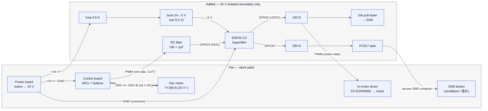

# Heran/Hanny Fan → Home Assistant — Build Guide (ESP32-C3)

> 🚧 **Status: work in progress — not yet hardware-tested.** Values below come
> from multimeter DC-average readings; the **PWM logic level (3.3 vs 5 V) and
> frequency are unverified**. **Before wiring:** identify your board/harness,
> confirm mains↔secondary isolation, and measure the actual PWM high level and
> waveform (Section 4 / `HA_MOD_NOTES.md`). A series resistor is not overvoltage
> protection.

Build notes for the **hybrid** control design derived from the teardown +
multimeter measurements. See `NOTES.md`, `pcb_2/NOTES.md`, `HA_MOD_NOTES.md` for
the reverse-engineering behind it.

**Contents:** §1 BOM · §2 wiring tables · §2b PWM break-out · §2c diagram ·
§2d assembly · §3 ESPHome · §4 flash/calibrate/test · §5 safety · §5b physical
buttons · §6 optional.

**Design in one line:** ESP32-C3 takes over **speed** by driving the motor
driver's **logic-level PWM** (likely 3.3 V — **verify first**), and controls
**oscillation** by "tapping"
the stock **SW5 (摇头)** button through an optocoupler (the stock board keeps
generating the AC the synchronous oscillation motor needs).

Measurements this relies on (multimeter DC averages — logic level/frequency still to confirm on your unit):
- `CN2` pin1 `PWM` = **logic-level (likely 3.3 V — unverified)**, active-high, off = 0 V. 12 speed levels,
  duty ≈ **24 % (L1, min-spin) → ~90 % (L12, max)**. Driver reads the PWM average.
- `CN2` `GND` (pin2), `+24V` (pin3). `OSC-A/B` (pins 4/5) = ~24 V **AC** to the
  `TYJ50-8` synchronous oscillation motor — left to the stock board.

---

## 1. Bill of materials

| # | Part | Notes |
|---|------|-------|
| 1 | **ESP32-C3** dev board | 3 GPIOs used: GPIO3 (in), GPIO4 (PWM out), GPIO5 (osc) |
| 2 | **Buck converter 24 V→5 V** (MP1584 / "mini-360") | set output to **5.0 V** before use |
| 3 | **Optocoupler PC817** (×1) | to tap SW5 |
| 4 | Resistor **330 Ω** (×1) | PC817 LED (from GPIO5) |
| 5 | Resistor **100 Ω** (×1) | series in the motor-side PWM line (tames edges) |
| 6 | Resistor **10 kΩ** (×2) | **RC-filter series** (GPIO3 input) + **motor-side PWM pull-down** to GND |
| 7 | Capacitor **1 µF** (×1) | RC low-pass to GND on the GPIO3 input (with the 10 kΩ above) |
| 8 | **Fuse 0.5 A** + inline holder | on the +24 V tap |
| 9 | Hook-up wire, heatshrink, JST/Dupont | to interpose on `CN2` |
| 10 | *(optional)* **BSS138 level-shifter** + 2× **10 kΩ** (divider) | only if the PWM turns out to be 5 V |
| 11 | *(optional)* 5-pin JST male+female **matching CN2** | reversible inline interposer (see §2b) |

**Tools:** multimeter (ideally Hz/duty), soldering iron, wire strippers, heatshrink;
for the reversible interposer, a JST housing/pitch that matches your `CN2`.

---

## 2. How it hooks in (interpose on the CN2 harness)

We break **only the PWM wire** in the `CN2` harness; everything else passes
through so the stock board still powers the motor and drives oscillation.

### Table A — CN2 harness (control board ↔ motor assembly)
| CN2 pin | Signal | What to do |
|--------:|--------|------------|
| 1 | `PWM` | **CUT.** Motor-side → **ESP GPIO4** (via 100 Ω) **+ ~10 kΩ pull-down to GND**. Control-board side → **RC low-pass → GPIO3** (Option B) or insulate (speed-only). |
| 2 | `GND` | Keep through. Also tie to **ESP GND** and **buck GND** (one common ground). |
| 3 | `+24V` | Keep through. Also tap → **fuse** → **buck +IN**. |
| 4 | `OSC-A` | **Pass through untouched** (stock board drives oscillation). |
| 5 | `OSC-B` | **Pass through untouched.** |

### Table B — ESP32-C3 connections
| ESP32-C3 | To |
|----------|----|
| `5V` | buck **+5 V** out |
| `GND` | buck GND = `CN2 GND` (common) |
| `GPIO4` | 100 Ω → `CN2` `PWM` (**motor side**) |
| `GPIO5` | 330 Ω → PC817 pin 1 (LED anode) |

### Table C — PC817 optocoupler across the SW5 (摇头) button
| PC817 pin | To |
|----------:|----|
| 1 (LED anode) | ESP `GPIO5` via 330 Ω |
| 2 (LED cathode) | ESP `GND` |
| 3 (emitter) | SW5 pad on the **GND side** |
| 4 (collector) | SW5 pad on the **MCU-input side** |

> **Find SW5 polarity first:** with the fan **powered (plugged in, in standby)**,
> meter in DC-V, find which SW5 pad
> sits at a positive voltage (pulled up to the MCU) and which is 0 V (GND). Put the
> PC817 **collector on the pulled-up pad**, **emitter on the GND pad**. If the tap
> doesn't work, swap pins 3/4.

### ASCII overview
```
 POWER BOARD (24V) ──CN1──► CONTROL/DISPLAY BOARD (head) ──┐
                                    │  SW5 (摇头) pads ──[PC817 3/4]
                                    │                        ▲
                           CN2 harness (to motor)            │ opto
   pin1 PWM ─✂─ ctrl side ──[RC 10kΩ+1µF]──► GPIO3 (ADC)     │
        motor side ──100Ω──► GPIO4 ;  motor side ──10kΩ──► GND │
   pin2 GND ───────────────┬──► ESP GND ──────[PC817 2]──────┘
   pin3 +24V ──[fuse]──► [24V→5V buck] ──5V──► ESP 5V
   pin4 OSC-A ─────────► (through to TYJ50-8, stock-driven)
   pin5 OSC-B ─────────► (through to TYJ50-8, stock-driven)
                           GPIO5 ──330Ω──► [PC817 1]
```

---

## 2b. Breaking out just the PWM wire (cut vs. reversible interposer)

Only the **PWM** wire is interrupted; `GND`, `+24V`, `OSC-A`, `OSC-B` stay
connected. **Verify which wire is PWM first** — meter in continuity to the `CN2`
PWM pad (pin 1); don't trust wire colour. Never cut `+24V`/`GND` — *tap* them
(solder a branch or back-probe) for the buck and common ground.

**Method 1 — cut the PWM wire (simplest, not easily reversible).**
Cut only the PWM wire mid-span. Control-board side → RC (10 kΩ + 1 µF) → GPIO3;
motor side → 100 Ω → GPIO4 (+ 10 kΩ pull-down to GND). Heatshrink both joints.

**Method 2 — sacrificial JST extension (recommended, fully reversible).**
Buy a matching 5-pin JST male↔female extension and cut the **PWM wire on the
extension, not on the fan**. Plug it inline: control-board `CN2` header →
extension → fan's original harness. The 4 other wires pass straight through; only
PWM breaks out to your board. To restore stock, just remove the extension — the
fan's wiring is never touched (Variant C1 reversibility).

**Method 3 — depin the connector (advanced).**
Release the PWM crimp pin from the `CN2` housing (lift the lock tab, slide the
pin out) and insert a new crimped pin from GPIO4 in its place. Reversible but
needs a depin tool + crimp skills; Method 2 is easier.

## 2c. Wiring diagram (Option B)

Signal-flow overview (exact pins/resistor values are in Tables A–C above).
GitHub renders this diagram automatically.



**Key:** the `PWM` wire is **cut** — the control-board side feeds the ESP's ADC
(`GPIO3`) and the motor side is driven by the ESP (`GPIO4`). Everything on the
"Added" side lives on the **isolated 24 V secondary**; never bridge mains.

## 2d. Assembly — bench-test first, then make it permanent

> ⚠️ **A breadboard is for bench testing only — never leave one inside the fan.**
> Its spring contacts work loose with vibration and heat; a running fan will make
> them go intermittent. Prototype on a breadboard, then rebuild it **soldered**.

### Phase 1 — bench test (breadboard OK)
- Power the ESP32-C3 over **USB** (no fan connected yet).
- Hang the parts off the ESP with a **breadboard + Dupont jumpers**.
- Goal: flash the config, confirm the **Fan** + **Toggle Oscillation** entities in
  HA, meter-check that **GPIO4**'s average voltage rises with speed, and that
  **GPIO5** pulses when you press Toggle Oscillation.
- You can also test the mirror input by feeding **GPIO3** a known 0–3.3 V and
  watching the **"Stock PWM (avg)"** sensor track it.

### Phase 2 — permanent build (solder it)
Two equally good styles for this small parts count:

**A. Small perfboard (tidiest):**
- Mount the ESP32-C3 on **female header sockets** (so you can pop it out to
  reflash) — or solder it directly.
- Solder the **PC817, resistors (330 / 100 / 10 kΩ×2), and the 1 µF cap** onto the
  same perfboard; wire out to the **buck** and the fan's **CN2 / SW5** points.

**B. Point-to-point (no board needed):**
- Solder each resistor **inline in its wire** — 100 Ω in the GPIO4→PWM wire, 330 Ω
  in the GPIO5→opto wire, the RC **10 kΩ + 1 µF** on the GPIO3 wire, and the 10 kΩ
  **pull-down** at the motor-side PWM — and **heatshrink every joint**.

**Connections to the fan (keep it reversible):**
- Solder to the `CN2` wires / `SW5` pads, or — nicer — put a **JST/Dupont
  connector at the CN2 interposition** so the module unplugs and the fan returns
  to stock (Variant C1 reversibility).
- **Heatshrink/Kapton every joint**, keep **one common ground**, and add a dab of
  **hot glue for strain relief** so vibration can't crack a solder joint.
- Optional: a **470–1000 µF** cap across the ESP `5V`/`GND` smooths Wi-Fi current
  spikes.
- Secure the module in the base with hot glue / foam tape; keep the ESP antenna
  away from metal; leave USB reachable or rely on **OTA** for future updates.

## 3. ESPHome configuration

The **single source of truth is [`esphome/heran-fan.yaml`](esphome/heran-fan.yaml)**
— Option B (PWM mirror + override, with a **Toggle Oscillation** button). Flash
that file directly; don't hand-copy a config out of this guide.

**Setup**
1. Copy [`esphome/secrets.yaml.example`](esphome/secrets.yaml.example) to
   **`secrets.yaml`** in your ESPHome config folder and fill in Wi-Fi, the API key,
   and the fallback-AP password (generate the API key with the ESPHome "new device"
   wizard or `openssl rand -base64 32`).
2. **Calibrate** the substitutions at the top of the YAML: `adc_max_v` (the
   "Stock PWM (avg)" reading at max speed), `min_duty`/`max_duty` (L1/L12 duty),
   and `pwm_freq`. See Section 4.

**Pins:** `GPIO4` = PWM out · `GPIO3` = mirror input (via RC filter) · `GPIO5`
= oscillation tap.

Speed → duty reference (for tuning / if you use `speed_count: 12`):

| Level | Duty | Level | Duty |
|------:|------|------:|------|
| L1 | 24 % (min) | L7 | 55 % |
| L2 | 30 % | L8 | 60 % |
| L3 | 38 % | L9 | 64 % |
| L4 | 45 % | L10 | 68 % |
| L5 | 47 % | L11 | 80 % |
| L6 | 52 % | L12 | ~90 % (max) |

---

## 4. Flash, calibrate, and test (do in this order)

> These steps are for the canonical **Option B** config
> (`esphome/heran-fan.yaml`), which boots in **mirror mode** (the fan follows the
> physical panel) and exposes a **"Toggle Oscillation" button**.

**Flash (bench, no fan):**
1. In Home Assistant's **ESPHome** add-on, create a device and paste
   `esphome/heran-fan.yaml`. Copy `esphome/secrets.yaml.example` to **`secrets.yaml`
   in the same ESPHome config folder** and fill in Wi-Fi + keys. Generate the
   API/OTA key with the ESPHome "new device" wizard or `openssl rand -base64 32`.
2. Plug the ESP32-C3 in over **USB-C** and flash. If it isn't detected: **hold
   BOOT, tap RST, release BOOT**, then flash. Confirm a **Fan** entity and a
   **Toggle Oscillation** button appear in HA.
3. Meter on **GPIO4→GND**: HA off = 0 V; raising the HA speed raises the average
   voltage. Press **Toggle Oscillation** → **GPIO5** pulses briefly.

**Wire (fan unplugged):**
4. Set the buck to **5.0 V** (meter) **before** connecting it to the ESP.
5. Do the wiring (Tables A–C + §5b). Double-check: one common GND; the **fuse** on
   +24 V; the **10 kΩ pull-down** on the motor-side PWM; and the cut control-side
   PWM going through the **RC filter → GPIO3**.

**Calibrate (fan powered):**
6. Power on. In HA, watch the **"Stock PWM (avg)"** sensor, set the fan to **max
   (L12)** with the physical button, read that voltage, and put it in the
   `adc_max_v:` substitution; re-flash. (Tune `min_duty`/`max_duty` similarly.)

**Test:**
7. **Mirror:** with no HA command, the fan follows the physical panel.
8. **Speed:** set a speed in HA → the motor follows (override). Press the physical
   风速 button → control returns to the panel.
   - *No response?* Try `pwm_freq: 1000Hz`/`5000Hz`/`20000Hz`. Still nothing → the
     PWM input may be 5 V: add proper level translation on GPIO4→PWM (a series
     resistor is **not** protection).
9. **Oscillation:** press **Toggle Oscillation** → head swings; press again →
   stops. If nothing, swap PC817 pins 3/4 (polarity).
10. **Fail-safe:** reboot the ESP → the fan follows the panel (motor off if the
    panel is off); confirm the motor-side pull-down holds the driver off while the
    ESP boots.

## 5. Safety

- Work **only on the 24 V isolated secondary** (`CN2`). Never touch or bridge the
  mains/SMPS primary. Keep the power board in its housing.
- **Fuse** the +24 V tap (0.5 A). Verify buck = 5.0 V before wiring to the ESP.
- Insulate the cut **control-side PWM** wire so it can't short.
- **Fail-safe:** `zero_means_zero: true` only holds the output low *while the
  firmware runs*. During **boot/reset or loss of ESP power, GPIO4 is high-impedance**,
  so add a **~10 kΩ pull-down from the motor-side PWM to GND** so the driver sees
  LOW (motor off) then. On **Wi-Fi loss** the last commanded speed simply persists
  (the fan keeps running) — verify that is acceptable for you.
- Reassemble with proper strain relief; don't pinch wires near the blade or gears.

---

## 5b. Keeping the physical buttons working

The base design cuts the PWM wire, so the stock **speed/power** buttons no longer
reach the motor (only **oscillation/SW5** still works, since OSC passes through).
Two ways to restore full physical control:

### Option A — Button injection (simplest; 100% stock behaviour)
Do **not** cut PWM. Leave the control board driving the motor and have the ESP
**press the buttons in parallel** via optocouplers (one PC817 per button, wired
like Table C but across `SW1..SW5`). Physical buttons and HA both work.
- HA speed = "tap 风速 to cycle" the 12 levels (step control, not continuous).
- Optionally sense the panel LEDs into GPIOs for state.
- Wiring: skip Table A's PWM cut entirely; add a PC817 across each button you want
  in HA; drive each from its own GPIO (e.g. GPIO3=SW1, GPIO4=SW2, GPIO5=SW3,
  GPIO6=SW4, GPIO7=SW5). Speed becomes step-up/step-down buttons in HA.

### Option B — PWM mirror + override (physical buttons *and* continuous HA speed)
Keep the interposer, but feed the **control-board-side PWM into an ESP input** so
the ESP can mirror the panel and know the current speed. **The ready-to-flash
implementation is [`esphome/heran-fan.yaml`](esphome/heran-fan.yaml)** — use it
rather than the reference stub in Section 3.

Extra wiring vs. Tables A/B:

| From | Through | To |
|------|---------|----|
| `CN2` `PWM` **control-board side** | **RC low-pass: ~10 kΩ series + 1 µF to GND** (+ a resistor divider if the signal is >3.3 V) | ESP **GPIO3** (ADC) |
| `CN2` `PWM` **motor side** | **~10 kΩ pull-down to GND** (fail-safe when the ESP is off/resetting) | ESP **GPIO4** (LEDC out) |

Why ADC (not `duty_cycle`): a 10–20 kHz PWM would fire tens of thousands of edge
interrupts/sec. The RC low-pass turns the stock PWM into a **steady average
voltage** the ADC reads cheaply — and it also works if the stock output is
analog rather than PWM.

**Calibrate:** flash the config, watch the **"Stock PWM (avg)"** sensor, set the
fan to **max (L12)**, and copy that voltage into the `adc_max_v:` substitution.
Tune `handback_delta`, `min_duty`, `max_duty` to your readings.

> ⚠️ **Before connecting GPIO3/GPIO4:** confirm the stock PWM's **actual high
> level ≤ 3.3 V** and that it is a real PWM (Section 4). A series resistor is
> **not** overvoltage protection — if it's 5 V, add real level translation
> (verified for your signal), and size the divider so the ADC never exceeds ~3 V.

Oscillation is unchanged (SW5 tap). In the canonical config it is exposed as a
**"Toggle Oscillation" button** (a momentary tap; there is no stock state
feedback, so an on/off *switch* would drift out of sync). The physical SW5 button
also keeps working. *(Optional true feedback: sense "AC present" on OSC-A/OSC-B
via an optocoupler into a `binary_sensor` and build a real switch from it.)*

## 6. Optional upgrades
- **True oscillation state:** if the panel has an oscillation indicator LED, sense
  it into a spare GPIO (`binary_sensor`) and drop `optimistic:` for real feedback.
- **Local buttons:** wire the stock `SW1–SW5` to spare C3 GPIOs later for on-device
  control alongside HA.
- **RPM:** solder a tap to the `FK-EGP00962` `F.G` pad and add a `pulse_counter`
  (see `HA_MOD_NOTES.md` §6) — not wired stock.
